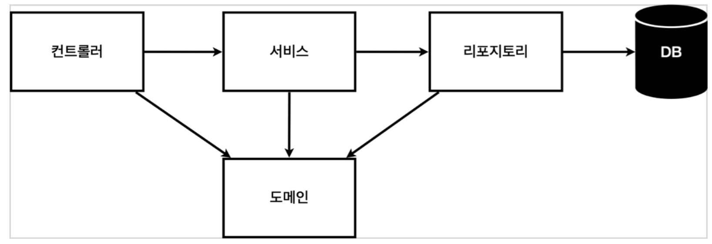

# 스프링 입문 - 코드로 배우는 스프링 부트, 웹 MVC, DB 접근 기술

## 프로젝트 환경설정

- [스프링 이니셜라이저](https://start.spring.io/) 에서 각종 설정을 하면 프로젝트 세팅을 해준다.
  - 설정하는 것
    - maven, gradle 디펜던시 관리, 빌드, 번들링 등 전체적인 걸 봐주는 툴인듯. 요즘은 gradle
    - 스프링부트 버전
    - 프로젝트 메타데이터들
    - 당겨 쓸 디펜던시
  - build.gradle
    - plugins, versions, 등등 그레이들이 관리하는 프로젝트 컨피그?
    - repositories = mavenCentral 에서 디펜던시들 내려받아라
    - 뭐 대충 ~
  - 뷰 환경 설정
    - `@Controller` 어노테이션을 붙이면 컨트롤러 클래스가 생성되고 스프링에 등록됨
    - 컨트롤러 클래스의 퍼블릭 메소드에 엔드포인트와 메소드를 매핑해서 각 요청을 핸들링 할 수 있다.
    - 각 메소드는 Model 의존성을 주입받아서 attribute를 추가할 수 있다.
    - 컨트롤러가 문자열을 리턴하면 viewResolver 가 이름에 맞는 html을 찾고 마찬가지로 Model 주입해주는 것 같다.
    - 근데 이 일련의 과정을 하는게 스프링 '부트' 라고 하시는디 그냥 오토 컨피그 말고 다른게 있는건가? 모르겠다.
    - ㅇㅎ... 앞에 내장 톰캣 서버가 붙고 뒤에 스프링 컨테이너가 있는 이 전체 그림을 스프링 부트가 제공해주는듯...!
    - 뷰 리졸버는 스프링에 있음
  - build & run
    - ./gradlew build
    - java -jar ./build/libs/~~~.jar

## 스프링 웹 개발 기초

- 정적 컨텐츠
  - 요청이 들어온다. 
  - 내장 톰캣 서버가 스프링 컨테이너한테 컨트롤러 있는지 물어본다 ( 컨트롤러가 우선순위를 가진다는 뜻 )
  - 없으면 톰캣서버가 resource: static/hello-static.html 을 찾아서 내려준다
- MVC와 템플릿 엔진
  - 뷰 환경설정에서 한것과 똑같음.
  - 장고가 새록새록...
- API
  - 컨트롤러 메소드에 `@ResponseBody` 를 붙이면 http body에 내용을 직접 반환함.
  - 이럴 경우에는 viewResolver 대신 HttpMessageConverter가 동작.
  
## 회원 관리 예제

- 일반적인 아키텍쳐
  - 
  - 나중에 좀 더 보자
- controller
  - 는 안했다.
- domain
  - 회원 정보와 이름을 가지고, 게터/세터만 있는 Member 클래스 생성
- repository
  - Member 를 save, find 하는 MemberRepository 인터페이스 생성. (DB를 정하지 않았다는 가정이 있어서.)
  - 일단 사용할 메모리에 저장하는 형태로 MemeoryRespository를 구현한  MemoryMemberRepository 생성
- service
  - 비즈니스 로직이 담겨있음. 
  - 예제 기준) 내부적으로 memberRepository를 사용? 하는데 이떄 service 에서 인스턴스를 생성하는 형태가 되면 ( 왜안좋지...? 까먹음 아무튼 ) 안되니 외부에서 생성자를 통해 주입받는 형태로 작성. DI 의존성주입